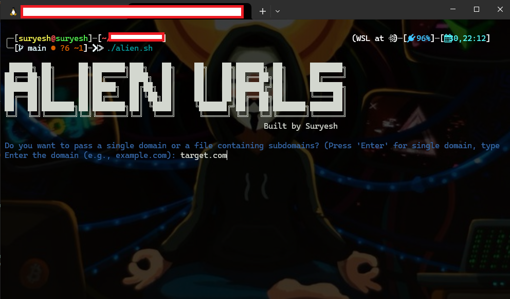
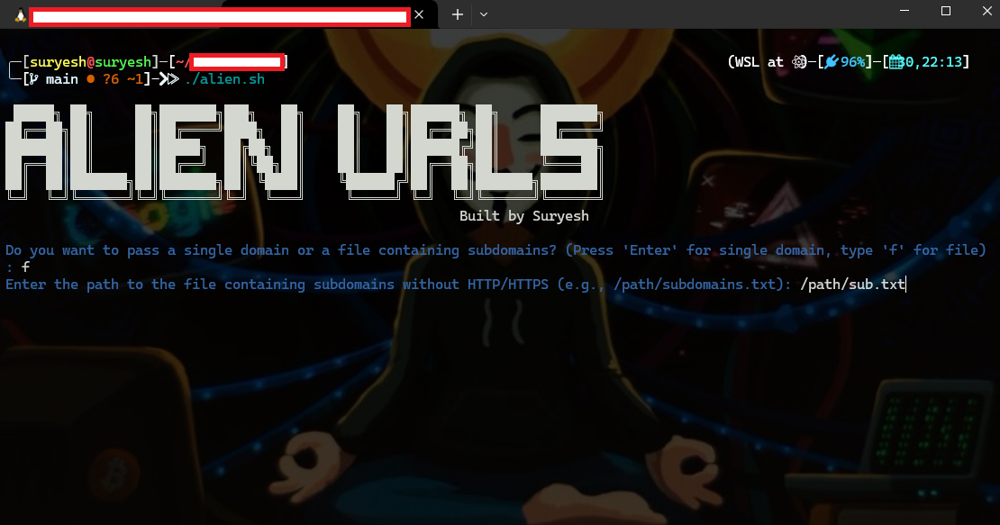

# OTX_AlienVault_URL

# Description:
The OTX Scraper is a Bash script designed to fetch URLs associated with a given domain from AlienVault's Open Threat Exchange (OTX) platform. It is particularly useful for cybersecurity professionals and researchers who want to gather intelligence for reconnaissance and vulnerability analysis.

The script utilizes the AlienVault OTX API to query URLs linked to the specified domain and saves the results in a structured format for further analysis.


# Features

- **Automated Scraping:** Fetches URLs associated with a domain in paginated batches.
- **Error Handling:** Stops gracefully when no more URLs are available.
- **Output Management:** Saves all results in a timestamped, organized folder structure for easy access.
- **Interactive Input:** Prompts the user for input with a user-friendly interface.
- **Colored Output:** Displays informational, error, and success messages with clear color coding for better readability.

# Usages

1. Clone This Repository
   ```
   git clone https://github.com/Suryesh/OTX_AlienVault_URL.git
   ```
3. Now go to OTX_AlienVault_URL directory
   ```
   cd OTX_AlienVault_URL
   ```
5. Give File Executable Permission
   ```
   chmod +x alien.sh
   ```
7. Now good to go, run the file
   ```
   ./alien.sh or bash alien.sh
   ```
8.  Press `Enter` for single domain and enter your domain and for passing the subdomain file type `f`
9.  Output will be saved automatically

# Screenshots

### Domain


### Subdomain


### Results


