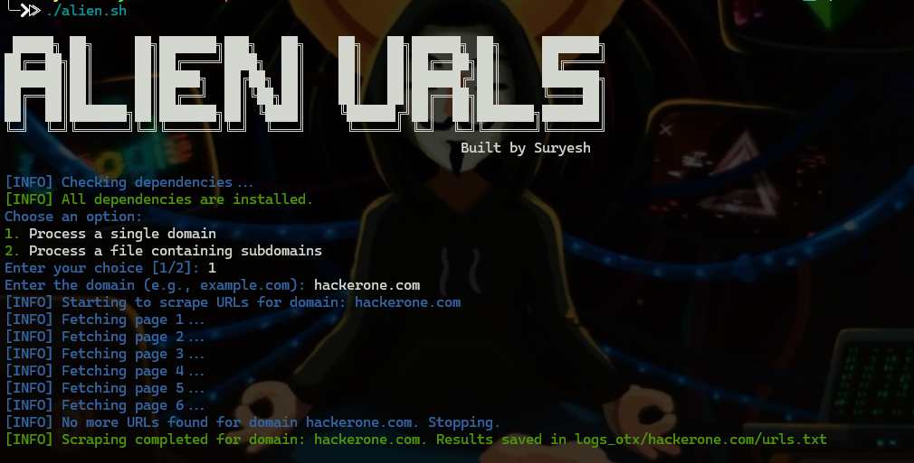
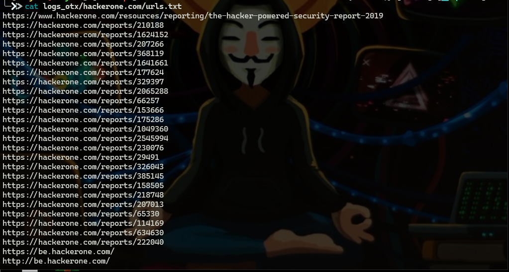
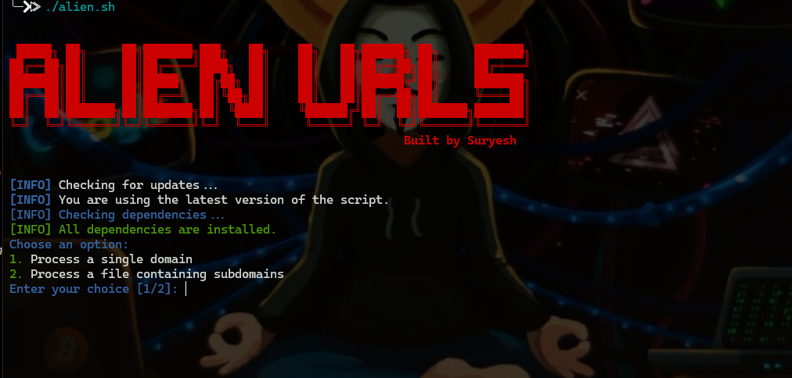

# OTX_AlienVault_URL

The OTX AlienVault URL Scraper is a Bash script designed to fetch URLs associated with a given domain from AlienVault's Open Threat Exchange (OTX) platform. It is particularly useful for cybersecurity professionals and researchers who want to gather intelligence for reconnaissance and vulnerability analysis.

The script utilizes the AlienVault OTX API to query URLs linked to the specified domain and saves the results in a structured format for further analysis.


# Features

- **Automated Scraping:** Fetches URLs associated with a domain in paginated batches.
- **Error Handling:** Stops gracefully when no more URLs are available.
- **Output Management:** Saves all results in a timestamped, organized folder structure for easy access.
- **Interactive Input:** Prompts the user for input with a user-friendly interface.
- **Colored Output:** Displays informational, error, and success messages with clear color coding for better readability.
- **Update Feature:** Prompt to the user for latest Version

# Usages

1. Clone This Repository
   ```
   git clone https://github.com/Suryesh/OTX_AlienVault_URL.git
   ```
3. Now go to OTX_AlienVault_URL directory
   ```
   cd OTX_AlienVault_URL
   ```
5. Give File Executable Permission
   ```
   chmod +x alien.sh
   ```
7. Now good to go, run the file
   ```
   ./alien.sh or bash alien.sh
   ```
8.  Choose Option `1` or `2`
9.  Output will be saved automatically

# Screenshots

### Format


### Target


### Results



### Update Feature


## License
This project is licensed under the MIT License. See the [](LICENSE) file for details.

 ## 💰 You can help me by Donating
 
  [](https://buymeacoffee.com/suryesh_92) [](https://www.paypal.com/paypalme/Suryesh92) 


## Disclaimer
This tool is intended for educational and ethical testing purposes only. Do not use it for any illegal or unauthorized activities. The author is not responsible for any misuse of this tool.


## Contributors

- [Sangharsha](https://github.com/noob6t5)
